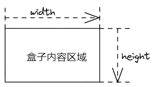

# CSS基础认知

## CSS层叠样式表（Cascading style sheets）

## CSS语法规则

## 位置

**CSS写在style标签中，style标签一般写在head标签里面，title标签下面**

## CSS引入方式

* **内嵌式**：CSS写在`style`标签中
  
  * 提示：`style`标签虽然可一个卸载页面任意位置，但是通常约定写在`head`标签中
  
* **外联式**：CSS写在单独的`.css`文件中
  
  * 提示：需要通过`link`标签在网页中引入
  
 * **行内式**：CSS写在标签的`style`属性中

   * 提示：不推荐，之后会配合`JS`使用

| 引入方式 | 书写位置                                 | 作用范围 | 使用场景    |
| -------- | ---------------------------------------- | -------- | ----------- |
| 内嵌式   | CSS写在style标签中                       | 当前页面 | 小案例      |
| 外联式   | CSS写在单独的CSS文件中，通过link标签引入 | 多个页面 | 项目总      |
| 行内式   | css写在标签的style属性中                 | 当前标签 | 配合JS使用 |

```html
<!DOCTYPE html>
<html lang="en">

<head>
    <meta charset="UTF-8">
    <meta http-equiv="X-UA-Compatible" content="IE=edge">
    <meta name="viewport" content="width=device-width, initial-scale=1.0">
    <title>Document</title>
    <style>
        /* css注释 */
        /* 这里写的都是CSS */
        /* 选择器{css属性} */
        /*  选择器：查找标签 */
        p {
            /* 文字颜色变红 */
            color: red;
            /* 字变大 px：像素 */
            font-size: 30px;
            /* 背景颜色 */
            background-color: aqua;
            width: 400px;
            height: 400px;
        }
    </style>
</head>

<body>
    <p>这时一个P标签</p>

</body>

</html>
```


# 基础选择器

## 标签选择器

* 结构：`标签名`{css属性名：属性值；}
* 作用：通过标签名，找到页面中所有这类标签，设置样式
* 注意
  * 1.标签选择器选择的是一类标签，而不是单独某一个
  * 2.标签选择器无论嵌套关系有多深，都能找到对应的标签

```html
<!DOCTYPE html>
<html lang="en">
<head>
    <meta charset="UTF-8">
    <meta http-equiv="X-UA-Compatible" content="IE=edge">
    <meta name="viewport" content="width=device-width, initial-scale=1.0">
    <title>Document</title>
    <style>
        p {
            color: red;
        }
    </style>
</head>
<body>
    <p>ppppppppp</p>
    <p>这个P是什么颜色呢</p>
</body>
</html>
```


## 类选择器

* 结构：*.类名*{css属性名：属性值：}

* 作用：通过类名，找到页面中所有带有这个类名的标签，设置样式

* 注意点：

  1.所有标签上都有`clss`属性，class属性的属性值称为`类名（类似于名字）`

  2.类名可以由数字、字母、下划线、中划线组成，但不能以数字或者中划线开头

  3.一个标签可以同时有多个类名，类名之间以空格隔开

  4.类名可以重复，一个选择器可以同时选中多个标签
  
```html
  <!DOCTYPE html>
  <html lang="en">
  <head>
      <meta charset="UTF-8">
      <meta http-equiv="X-UA-Compatible" content="IE=edge">
      <meta name="viewport" content="width=device-width, initial-scale=1.0">
      <title>Document</title>
      <style>
          .red {
              color: red;
          }
          .size {
              font-size: 66px;
          }
      </style>
  </head>
  <body>
      <p>111</p>
      <!-- 一个标签可以使用多个类名，需要空格隔开即可 -->
      <p class="red size">222</p>
      <div class="red">这个标签文字也要变红</div>
  </body>
  </html>
```

  

## id选择器

* 结构：`#id属性值`{css属性名：属性值；}

* 作用：通过id属性值，找到页面中带有这个id属性值的标签，设置样式

* 注意点：

  1.所有标签都有id属性

  2.id属性值类似于身份证号码，在一个页面中是唯一的，不可重复的。

  3.一个标签只能有一个id属性值

  4.一个id选择器只能选中一个标签

```html
<!DOCTYPE html>
<html lang="en">
<head>
    <meta charset="UTF-8">
    <meta http-equiv="X-UA-Compatible" content="IE=edge">
    <meta name="viewport" content="width=device-width, initial-scale=1.0">
    <title>Document</title>
    <style>
        #blue {
            color: skyblue;
        }
    </style>
</head>
<body>
   <div id="blue">这是要给div文字是蓝色的</div>
   <p>111</p>
</body>
</html>
```


## 通配符选择器

  * 结构:`*`{css属性名:属性值;}

  * 作用:找到页面中所有的标签，设置样式

  * 注意点

    1.开发中使用极少，只会在极特殊情况下才会用到

    2.在基础班小页面中可能会用于去除标签默认的`margin`和`padding`

```html
<!DOCTYPE html>
<html lang="en">
<head>
    <meta charset="UTF-8">
    <meta http-equiv="X-UA-Compatible" content="IE=edge">
    <meta name="viewport" content="width=device-width, initial-scale=1.0">
    <title>Document</title>
    <style>
        *{
            color: skyblue;
            margin: 0px;
            padding: 0px;
        }
    </style>
</head>
<body>
    <div>div</div>
    <p>ppp</p>
    <h1>h1</h1>
    <span>span</span>
</body>
</html>
```


##字体和文本样式

### 文字大小

* 属性名:`font-size`

* 取值:`数字+px`
* 注意点:
  * 谷歌浏览器默认文字大小是`16px`
  * 单位需要设置，否则无效

```html
<!DOCTYPE html>
<html lang="en">
<head>
    <meta charset="UTF-8">
    <meta http-equiv="X-UA-Compatible" content="IE=edge">
    <meta name="viewport" content="width=device-width, initial-scale=1.0">
    <title>Document</title>
    <style>
        p {
            font-size: 30px;
        }
    </style>
</head>
<body>
    <p>段落文字</p>
</body>
</html>
```


### 字体粗细

* 属性名:`font-weight`

* 取值:

  · 关键字:

  | 加粗 | bold   |
  | ---- | ------ |
  | 正常 | normal |
  
  · 纯数字：100~900的整百数:
  
  | 加粗 | 700  |
  | ---- | ---- |
  | 正常 | 400  |
  
* 注意点:

  	*	不是所有字体都提供九种粗细，因此部分取值页面中无变化
  	*	实际开发中以:正常、加粗两种取值使用最多

```html
<!DOCTYPE html>
<html lang="en">
<head>
    <meta charset="UTF-8">
    <meta http-equiv="X-UA-Compatible" content="IE=edge">
    <meta name="viewport" content="width=device-width, initial-scale=1.0">
    <title>Document</title>
    <style>
        div {
            font-weight: 700;
        }
        h1 {
            font-weight: 400;
        }
    </style>
</head>
<body>
    <div>这是div</div>
    <h1>这是一级标题</h1>
</body>
</html>
```


### 字体样式（倾斜）

* 属性名:`font-style`
* 取值：
  * 正常(默认值):normal
  * 倾斜:italic

```html
<!DOCTYPE html>
<html lang="en">
<head>
    <meta charset="UTF-8">
    <meta http-equiv="X-UA-Compatible" content="IE=edge">
    <meta name="viewport" content="width=device-width, initial-scale=1.0">
    <title>Document</title>
    <style>
        div {
            /* 倾斜 */
            font-style: italic;
        }
        em {
            /* 正常 */
            font-style: normal;
        }
    </style>
</head>
<body>
    <div>div文字</div>
    <em>倾斜</em>
</body>
</html>
```


### 字体样式 font-family

* 属性名:`font-family`

* 常见取值:`具体字数1、具体字数2、具体字数3...字体系列`

  * 具体字体:”Microsoft YaHei“、微软雅黑、黑体、宋体、楷体等等
  * 字体系列: sans-serif、serif等等

* 渲染规则:

  ​	1.从左往右按照顺序查找，如果电脑中未安装该字体，则显示下一个字体

  ​	2.如果都不支持，此时会根据操作系统，显示最后字体系列的默认字体

* 注意点:

  ​	1.如果字体名称中存在多个单问，推荐使用引号包裹

  ​	2.最后一项`字体系列不需要引号包裹`

  ​	3.网页开发时，尽量使用系统常见自带字体，保证不同用户浏览网页都可以正确显示

```html
<!DOCTYPE html>
<html lang="en">
<head>
    <meta charset="UTF-8">
    <meta http-equiv="X-UA-Compatible" content="IE=edge">
    <meta name="viewport" content="width=device-width, initial-scale=1.0">
    <title>Document</title>
    <style>
        div {
            color: skyblue;
            font-family: 楷体,黑体,sans-serif;
        }
    </style>
</head>
<body>
    <div>这是一个div标签</div>
</body>
</html>
```


### 样式的层叠问题

* 问题:
  * 给同一个标签设置了相同的样式，此时浏览器会如何渲染？
* 结果：
  * 如果给同一个标签设置了相同的属性，此时样式会叠加（覆盖），写在最下面的会生效
* TIP:
  * CSS(Cascading style sheets)**层叠样式表**
  * 所谓的层叠即叠加的意思，表示样式可以一层一层的叠层覆盖

```html
<!DOCTYPE html>
<html lang="en">
<head>
    <meta charset="UTF-8">
    <meta http-equiv="X-UA-Compatible" content="IE=edge">
    <meta name="viewport" content="width=device-width, initial-scale=1.0">
    <title>Document</title>
    <style>
        p {
            /* 层叠性:后面的覆盖前面的属性 */
            color: red;
            color: skyblue;
        }
    </style>
</head>
<body>
    <p>pppp</p>
    
</body>
</html>
```


### 字头font相关属性的连写

* 属性名: `font(复合属性)`
* 取值:
  * font:style weight size family;
* 省略要求:
  * 只能省略前两个，如果省略了相当于设置了默认值
* 注意点:如果需要同时设置`单独和连写`形式
  * 要么把单独的样式写在连写的下面
  * 要么把单独的样式写在连写的里面

```html
<!DOCTYPE html>
<html lang="en">
<head>
    <meta charset="UTF-8">
    <meta http-equiv="X-UA-Compatible" content="IE=edge">
    <meta name="viewport" content="width=device-width, initial-scale=1.0">
    <title>Document</title>
    <style>
        p {
            /* font-size: ;
            font-style: ;
            font-weight: ;
            font-family: ; */
            /* font: style weight size 字体*/
            font: italic  700 66px 宋体;
            font-style: normal;
        }
    </style>
</head>
<body>
    <p>这是P标签</p>
</body>
</html>
```


### 字体和文本祥光样式 修改元素外观样式

#### 文本缩进

* 属性名:`text-indent`
* 取值:
  * 数字+px
  * 数字+em(推荐:1em=当前标签的font-size的大小)`1em=12px`

```html
<!DOCTYPE html>
<html lang="en">

<head>
    <meta charset="UTF-8">
    <meta http-equiv="X-UA-Compatible" content="IE=edge">
    <meta name="viewport" content="width=device-width, initial-scale=1.0">
    <title>Document</title>
    <style>
        p {
            /* text-indent: 50px; */
            /* 首行缩进2个字的大小 */
            /* 默认字号:16px */
            /* text-indent: 32px; */
            text-indent: 2em;
        }
    </style>
</head>

<body>
    <p>2019年，事件视界望远镜团队让世界首次看到了黑洞的样子。不过，研究人员公布的这张发光环形物体的图像并不是传统的图片，而是经过计算获得的。利用位于美国、墨西哥、智利、西班牙和南极地区的射电望远镜所得到的数据，研究人员进行了数学转换，最终合成了这张标志性的图片。研究团队还发布了实现这一壮举所用的编程代码，并撰文记录这一发现，其他研究者也可以在此基础上进一步加以分析。
    </p>
</body>

</html>
```


#### 文本水平对齐方式

* 属性名:`text-align`
* 取值

| 属性值 | 效果     |
| ------ | -------- |
| left   | 左对齐   |
| center | 居中对齐 |
| right  | 右对齐   |

* 注意点:
  * 如果需要让文本水平居中,text-aligh属性给`文本所在标签(文本的父元素)`设置

```html
<!DOCTYPE html>
<html lang="en">
<head>
    <meta charset="UTF-8">
    <meta http-equiv="X-UA-Compatible" content="IE=edge">
    <meta name="viewport" content="width=device-width, initial-scale=1.0">
    <title>Document</title>
    <style>
        h1 {
            text-align: center;
            /* text-align: right; */
        }
        body {
            /* 这里为什么标题不会跟随body变化,是因为父元素关系
            h1标签没有设置对其才回去找body标签,设置了就不会
            img标签的父元素是body,所以就用body标签的对齐方式 */
            text-align: right;
        }
    </style>
</head>
<body>
    <h1>新闻标题</h1>
    
</body>
</html>
```


#### 文本修饰

* 属性名:`text-decoration`
* 取值:

| 属性值       | 效果             |
| ------------ | ---------------- |
| underline    | 下划线(常用)     |
| line-through | 删除线(不常用)   |
| overline     | 上划线(几乎不用) |
| none         | 无装饰线(常用)   |

```html
<!DOCTYPE html>
<html lang="en">
<head>
    <meta charset="UTF-8">
    <meta http-equiv="X-UA-Compatible" content="IE=edge">
    <meta name="viewport" content="width=device-width, initial-scale=1.0">
    <title>Document</title>
    <style>
        div {
            text-decoration: underline;
        }
        p {
            text-decoration: line-through;
        }
        h2 {
            text-decoration: overline;
        }
        a {
            text-decoration: none;
        }
    </style>
</head>
<body>
    <div>div</div>
    <p>ppp</p>
    <h2>h2</h2>
    <a href="#">我是超链接</a>
</body>
</html>
```
#### 行高

* 作用:控制一行的上下行间距
* 属性名:`line-height`
* 取值:
  * 数字+px
  * 倍数(当前标签font-size的倍数)
* 应用:
  * 1.让`单行文本`垂直居中可以设置`line-height:文字父元素高度`
  * 2.网页精准布局时,会设置`line-height:1`可以取消上下间距
* 行高与font连写的注意点:
  * 如果同时设置了行高和font连写,注意覆盖问题
  * font: style weight size/line-hetight family;

## 选择器的进阶

### 1.复合选择器

##### ①.后代选择器:空格

* 作用:根据HTML标签的嵌套关系，选择父元素`后代中`满足条件的元素
* 选择器语法:`选择器1 选择器2 {css}`
* 结果:
  * 在选择器1所找到标签的后代（儿子、孙子、重孙子.…）中，找到满足选择器2的标签，设置样式
* 注意点:
  * 1.后代包括：儿子、孙子、重孙子.…
  * 2.后代选择器中，选择器与选择器之前通过`空格`隔开

```html
<!DOCTYPE html>
<html lang="en">
<head>
    <meta charset="UTF-8">
    <meta http-equiv="X-UA-Compatible" content="IE=edge">
    <meta name="viewport" content="width=device-width, initial-scale=1.0">
    <title>Document</title>
    <style>
        div p {
            color: skyblue;
        }
    </style>
</head>
<body>
    <p>这是一个p标签</p>
    <div>
        <p>这是div的儿子P</p>
    </div>
</body>
</html>
```


##### ②.子代选择器:>

* 作用:根据HTML标签的嵌套关系,选择父元素`子代中`满足条件的元素
* 选择器语法`选择器1>选择器2 {css}`
* 结果:
  * 在选择器1所找到标签的子带(儿子)中,找到满足选择器2的标签,设置样式
* 注意点:
  * 1.子带只包括:儿子
  * 2.子代选择器中,选择器与选择器之前通过`>`隔开

```html
<!DOCTYPE html>
<html lang="en">

<head>
    <meta charset="UTF-8">
    <meta http-equiv="X-UA-Compatible" content="IE=edge">
    <meta name="viewport" content="width=device-width, initial-scale=1.0">
    <title>Document</title>
    <style>
        /* div a { */
            /* 空格隔开的是后代,儿子,孙子 */
            /* color: skyblue; */

        /* } */
        /* div的儿子a文字颜色是红色 */
        div>a {
            color: skyblue;
        }
    </style>
</head>

<body>
    <div>
        父级
        <a href="#">这是DIV里面的a</a>
        <p><a href="#">这是DIV里面的p里面的a</a></p>
    </div>
</body>

</html>
```


##### ③.并集选择器:,

* 作用:同时选择多组标签,设置相同的样式
* 选择器语法:`选择器1,选择器2{css}`
* 结果:
  * 找到选择器1和选择器2选中的标签,设置样式
* 注意点:
  * 1.并集选择器中的每组选择器之间通过`,`分割
  * 2.并集选择器中的每组选择器可以是基础选择器或者复合选择器
  * 3.并集选择器中的魅族选择器通常一行写一个,提高代码可读性

```html
<!DOCTYPE html>
<html lang="en">
<head>
    <meta charset="UTF-8">
    <meta http-equiv="X-UA-Compatible" content="IE=edge">
    <meta name="viewport" content="width=device-width, initial-scale=1.0">
    <title>Document</title>
    <style>
        /* p div span h1 文字颜色是天蓝色 */
        /* 选择器1,选择器2{} */
        p,
        div,
        span,
        h1 {
            color: skyblue;
        }
    </style>
</head>
<body>
    <p>ppp</p>
    <div>div</div>
    <span>span</span>
    <h1>h1</h1>
    <h2>h2</h2>
</body>
</html>
```


##### ④.交集选择器:紧挨着

* 作用:选中页面中`同时满足`多个选择器的标签
* 选择器语法:`选择器1选择器2{css}`
* 结果:
  * (既又原则)找到页面中**即**能被选择器1选中,**又**能被选择器2选中的标签,设置样式
* 注意点:
  * 1.交集选择器中的选择器之间是紧挨着的,没有东西分割
  * 交集选择器中如果有标签选择器,标签选择器必须写在最前面

```html
<!DOCTYPE html>
<html lang="en">

<head>
    <meta charset="UTF-8">
    <meta http-equiv="X-UA-Compatible" content="IE=edge">
    <meta name="viewport" content="width=device-width, initial-scale=1.0">
    <title>Document</title>
    <style>
        p.box {
            color: skyblue;
        }
    </style>
</head>

<body>
    <!-- 找到第一个p,带box类的 -->
    <p class="box">这是P标签:box</p>
    <p>ppppp</p>
    <div class="box">这是DIV标签:box</div>
</body>

</html>
```


⑤.hover伪类选择器

* 作用:选中鼠标`悬停`在元素上的`状态`,设置样式
* 选择器语法:选择器`:hover`{css} 
* 主语点:
  * 1.伪类选择器选中的元素的`某种状态`

```html
<!DOCTYPE html>
<html lang="en">
<head>
    <meta charset="UTF-8">
    <meta http-equiv="X-UA-Compatible" content="IE=edge">
    <meta name="viewport" content="width=device-width, initial-scale=1.0">
    <title>Document</title>
    <style>
        a:hover {
            /* 悬停颜色 */
            color: skyblue;
            /* 悬停背景颜色 */
            background-color: rebeccapurple;
        }
    </style>
</head>
<body>
    <a href="#">这是超链接</a>
</body>
</html>
```


## emmet语法

* 作用: 通过简写语法,快速生成代码

* 语法:

  | 记忆       |        实例         | 效果                                 |
  | ---------- | :-----------------: | ------------------------------------ |
  | 标签名     |         div         | <div></div>                          |
  | 类选择器   |        .red         | <div class='red'></div>              |
  | id选择器   |        #one         | <div id="one"></div>                 |
  | 交集选择器 |      p.red#one      | <p class="red" id="one"></p>         |
  | 子代选择器 |        ul>li        | <ul><li></li></ul>                   |
  | 内部文本   | ul>li{我是li的内容} | <ul><li>我是li的内容</li></ul>       |
  | 创建多个   |       ul>li*3       | <ul><li></li><li></li><li></li></ul> |

# 背景相关属性

## 1 背景颜色

* 属性名:`background-color(bgc)`
* 属性值:
  * 颜色取值:关键字,rgb表达法,rgba表达法,十六进制...
* 注意点:
  * 背景颜色默认值是透明:rgba(0,0,0,0) transparent
  * 背景颜色不会影响盒子大小,兵器还能看清盒子的大小和位置,一般在布局中会习惯献给盒子设置背景颜色

```html
<!DOCTYPE html>
<html lang="en">
<head>
    <meta charset="UTF-8">
    <meta http-equiv="X-UA-Compatible" content="IE=edge">
    <meta name="viewport" content="width=device-width, initial-scale=1.0">
    <title>Document</title>
    <style>
        div {
            width: 400px;
            height: 400px;
            /* background-color: pink; */
            background-color: rgba(0,0,0,0.5);
        }
    </style>
</head>
<body>
    <div>div</div>
</body>
</html>
```


##  2 背景图片

* 属性名:`background-image(`emmet语法简写bgi`)`
* 属性值:**background-image:url('路径');**
* 注意点:
  * 1.背景图片中url可以省略引号
  * 2.背景图片默认是在水平和垂直方向平铺的
  * 3.背景图片仅仅是指给盒子起到装饰效果,类似于背景颜色,是不能撑开盒子的 

```html
<!DOCTYPE html>
<html lang="en">
<head>
    <meta charset="UTF-8">
    <meta http-equiv="X-UA-Compatible" content="IE=edge">
    <meta name="viewport" content="width=device-width, initial-scale=1.0">
    <title>Document</title>
    <style>
        div {
            width: 600px;
            height: 600px;
            background-color: pink;
            background-image: url(./images/1.jpg);
        }
    </style>
</head>
<body>
    <div>文字</div>
</body>
</html>
```


## 3 背景平铺

* 属性名:`background-repeat`(bgr)
* 属性:

| 取值      | 效果                         |
| --------- | ---------------------------- |
| repeat    | (默认值)水平和垂直方向都平铺 |
| no-repeat | 不平铺                       |
| repeat-x  | 沿着水平方向(x轴)平铺        |
| repeat-y  | 沿着垂直方向(y轴)平铺        |

```html
<!DOCTYPE html>
<html lang="en">
<head>
    <meta charset="UTF-8">
    <meta http-equiv="X-UA-Compatible" content="IE=edge">
    <meta name="viewport" content="width=device-width, initial-scale=1.0">
    <title>Document</title>
    <style>
        div {
            width: 600px;
            height: 600px;
            background-color: pink;
            background-image: url(./images/1.jpg);
            /* background-repeat: no-repeat; */
            background-repeat: repeat-x;
        }
    </style>
</head>
<body>
    <div>文字</div>
</body>
</html>
```


## 4 背景位置

* 属性名:`background-position`(bgp)
* 属性值:**background-position:水平方向位置 垂直方向位置;**

$$
大括号示例
\begin{cases}
1 & 方向名词(最多只能表示9个位置)
\begin{cases}
水平方向
\begin{cases}
left\\
center\\
right\\
\end{cases}
\\
垂直方向
\begin{cases}
top\\
center\\
bottom\\
\end{cases}
\\
\end{cases}
\\
2 & 数字+px(坐标) 
\begin{cases}
坐标系
\begin{cases}
原点(0,0) & 盒子的左上角\\
x轴 & 水平向右\\
y轴 & 垂直向下\\
\end{cases}
\\
操作\\
\end{cases}
\\
\end{cases}
$$

```html
<!DOCTYPE html>
<html lang="en">
<head>
    <meta charset="UTF-8">
    <meta http-equiv="X-UA-Compatible" content="IE=edge">
    <meta name="viewport" content="width=device-width, initial-scale=1.0">
    <title>Document</title>
    <style>
        div {
            width: 400px;
            height: 400px;
            background-color: pink;
            background-image: url(./images/1.jpg);
            background-repeat: no-repeat;
            /* 图片在右面 */
            /* background-position: right 0; */
            /* 图片在右下 */
            /* background-position: right bottom; */
            /* 全部居中 */
            /* background-position: center center; */
            background-position: 50px 100px;
            /* 正数:向右向下移动;负数:向左向右移动 */
            /* 注意:背景色和背景图只显示在盒子里面 */
        }
    </style>
</head>
<body>
    <div>文字</div>
</body>
</html>
```

## 5 背景相关属性连写

* 属性名:`background`(bg)

* 属性值:
  * 单个属性值的合写,取值之间以空格隔开

* 书写顺序:
  * 推荐:background:color image repeat position

* 省略问题
  * 可以按照需求省略
  * 特殊情况:在pc端,如果盒子大小和背景图大小一样,此时可以直接写background:url()
* 注意点
  * 如果需要设置单独的样式和连写
    * ①要么把单的样式写在连写下面
    * ②要么把单独的样式写在连写里面

# 元素显示模式

## 块级元素

* 显示特点:
  * 1.独占一行(一行只能显示一个)
  * 2.宽度默认是父元素的宽度,高度默认由内容撑开
  * 3.可以设置宽高
* 代表标签:
  * `div`,`p`,`h系列`,ul,li,dl,dt,dd,form,header,nav,footer...

## 行内元素

* 显示特点:
  * 1.一行可以显示多个
  * 2.宽度和高度默认由内容撑开
  * 3.不可以设置宽度
* 代表标签:
  * a,span,b,u,i,s,strong,ins,em,del...

## 行内块元素

* 显示特点:
  * 1.一行可以显示多个
  * 2.可以设置宽高
* 代表标签
  * input,textarea,button,select...
  * 特殊情况:img标签有行内块元素特点,但是Chrome调试工具中显示结果是inline

## 元素显示模式转换

* 目的:改变元素默认的显示特点,让元素符合布局要求
* 语法:

| 属性                 | 效果             | 使用频率 |
| -------------------- | ---------------- | -------- |
| display:block        | 转换成块级元素   | 较多     |
| display:inline-block | 转换成行内块元素 | 较多     |
| display:inline       | 转换成行内元素   | 极少     |

## HTML嵌套规范注意点

1. 块级元素一般作为大容器,可以嵌套:文本,块级元素,行内元素,行内块元素等等...

​		但是:`p标签中不要嵌套div,p,h等块级元素`

2. a标签内部可以嵌套任意元素

​		但是:`a标签不能嵌套a标签`

# CSS特性

## 继承性

* 特点:子元素有默认继承父元素央视的特点(子承父业)
* 可以继承的常规属性(`文字控制属性都可以继承,不是控制文字的都不能继承`)
  * 1.color
  * 2.font-style,font-weight,font-size,font-family
  * 3.text-indent,text-align
  * 4.line-height
  * 5...
* 注意点:
  * 可以通过调试工具判断样式是否可以继承
  * 如果元素有浏览器默认样式,此时继承性依然存在,但是优先显示浏览器的默认样式
    * 1.a标签的color会继承失效(比如超链接依旧是蓝色)
    * 2.h系列标签的font-size会继承失效

## 层叠性

* 特性:
  * 1.给同一个标签设置不同的样式-->此时样式会层层叠加-->会共同作用在标签上
  * 2.给同一个标签设置相同的样式-->此时样式会层叠覆盖-->最终写在最后的样式会生效
* 注意点:
  * 1.当样式冲突时,只有当选择器优先级相同时,才会通过层叠行判断结果

## 优先级

### 基本测试

* 特性:不同选择器具有不同的优先级,优先级高的选择器样式会覆盖优先级低选择器样式
* 优先级公式:
  * **继承<通配符选择器<标签选择器<类选择器<id选择器<行内样式<!important**
* 注意点:
  * !important写在属性值的后面,分号的前面!
  * !important不能提升继承的优先级,`只要是继承优先级最低!`
  * 实际开发中不建议使用!important

###  权重叠加计算

* 场景：如果是复合选择器，此时需要通过权重叠加计算方法，判断最终哪个选择器优先级最高会生效
* 权重叠加计算公式：（每一级之间不存在进位）

|              |    第一级    |    第二级    |    第三级    |     第四集     |
| :----------: | :----------: | :----------: | :----------: | :------------: |
|              |      0       |      0       |      0       |       0        |
| 复合选择器中 | 行内样式个数 | id选择器个数 | 类选择器个数 | 标签选择器个数 |


* 比较规则：
  * 先比较第一级数字，如果比较出来了，之后的统统不看
  * 如果第一级数字相同，此时再去比较第二级数字，如果比较出来了，之后的统统不看
  * ...
  * 如果最终所有数字都相同，表示优先级相同，则比较层叠性（谁写在下面，谁说了算！）
* 注意点:`!important如果不是继承,则权重最高`

# 盒子模型

## 盒子模型的介绍

1.盒子的概念

 	1. 页面中的每一个标签,都可以看作是一个`盒子`,通过盒子的视角更方便的进行布局
 	2. 浏览器在渲染(显示)网页时,会将页面中的元素看作是一个个的举行区域,我们也形象的称之为`盒子`

2.盒子模型

​	CSS规定每个盒子分别由:**内容区域(content)**,**内边距区域(podding)**,**边框区域(border)**,**外边框区域(margin)**构成,这就是盒子模型

记忆:可以联想现实中的包装盒

## 内容区域的宽度和高度

作用:利用**width**和**height**属性默认设置是盒子**内容区域**的大小

属性:width/height

常见取值:数字+**px**



## 边框(border)

### 连写形式

* 属性:border

* 属性值:单个取值的连写,取值之间以空格隔开
  * 如:border:10px solid red;
* 快捷键:bd+tab

### 单方向设置(常用)

* 场景:只给盒子的某个方向单独设置边框
* 属性名:border-方位名词 **border-right: 5px solid #000;**
* 属性值:连写的取值

### 单个属性(不常用)

* 作用:给设置边框粗细,边框样式,边框颜色效果
* 单个属性:

|   作用   |    属性名    |                属性值                 |
| :------: | :----------: | :-----------------------------------: |
| 边框粗细 | border-width |                数字+px                |
| 边框样式 | border-style | 实线(solid),虚线(dashed),点线(dotted) |
| 边框颜色 | border-color |               颜色取值                |

## 内边距(pidding)

CSS3盒子模型(自动内减)

* 操作方法: 给盒子设置属性**box-sizing:border-box;**即可
* 优点:浏览器会自动计算多余大小,进行内容排版

## 外边距(margin)

版心居中:**margin: 0 auto ;**

### 外边框折叠现象-塌陷现象

* 场景:**互相嵌套**的块级元素,子元素的**margin-top**会作用在父元素上
* 结果:导致父元素往下移动
* 解决办法:
  * 1.给父元素设置border-top 或者 padding-top (分隔父子元素的margin-top)
  * 2.给父元素设置**overflow:hidden**
  * 3.转换成行内块元素
  * 4.设置浮动

# CSS浮动

## 结构伪类选择器

* 作用和优势:
  * 1.作用:根据元素在HTML中的结构关系查找元素
  * 2.优势:减少对HTML中类的依赖,有利于保持代码整洁
  * 3.场景:常用于查找某父级选择器中的子元素

* 选择器

|        选择器         |                                    说明 |
| :-------------------: | --------------------------------------: |
|    E:first-child{}    |   匹配父元素中第一个子元素，并且是E元素 |
|    E:last-child{}     |  匹配父元素中最后一个子元素，并且是元素 |
|   E:nth-child(n){}    |     匹配父元素中第个子元素，并且是E元素 |
| E:nth-last-child(n){} | 匹配父元素中倒数第个子元素，并且是E元素 |

​	

常见公式:

`注意点`:**如果用的是公式那么n从0开始计算**

​		0,1,2,3,4,5,6...

|       功能       |     公式      |
| :--------------: | :-----------: |
|       偶数       |    2n,even    |
|       奇数       | 2n+1,2n-1,odd |
|    找到前五个    |     -n+5      |
| 找到从第五个往后 |      n+5      |

## 伪元素

* 作用:使用**伪元素**在网页中创建内容
* 区别:
  * 1.元素:HTML设置的标签
  * 2.伪元素:由CSS模拟出的标签效果
* 种类:

| 伪元素   | 作用                             |
| -------- | -------------------------------- |
| ::before | 在父元素内容的最前添加一个伪元素 |
| ::after  | 在父元素内容二最后添加一个伪元素 |

* 注意:
  1. 必须设置content属性才能生效
  2. 伪元素默认是行内元素

## 标准流

* 标准流:又叫**文本流**,是浏览器在渲染显示页面内容时默认采用的一套排版规则,规定了应该以何种方式排列元素
* 常见排版规则:
  		1. 块级元素:从上往下,**垂直布局**,独占一行
    		1. 行内元素或者行内块元素:从左往右,**水平布局**,空间不够自动换行

## 浮动

### 浮动作用

早期作用:`图片环绕`

现在作用:`网页布局`

代码:**float:位置**

### 浮动的特点

1. 浮动元素会脱离标准流(简称:脱标),在标准流中不占位置(相当于从地面飘到了空中)

2. 浮动元素比标准流高半个级别,可以覆盖标准流中的元素

3. 浮动找浮动,下一个浮动元素会再上一个浮动元素后面左右浮动

4. 浮动元素有特殊的显示效果

   		* 一行可以显示多个

   		* 可以设置宽高

注意:

​	* 浮动的元素不能通过text-align:center或者margin:0 auto

## 清除浮动

### 介绍

* 含义:`清除浮动带来的影响`
  * 影响:如果子元素浮动了,此时子元素不能撑开标准流的块级父元素
* 原因:
  * 子元素浮动后脱标-->不占位置
* 目的:
  * 需要父元素由高度,从而不影响其他网页元素的布局

### 方法

# 设置父元素高度

* 特点:
  * 优点:简单粗暴,方便
  * 缺点:有些布局中不能固定父元素高度.如:新闻列表,京东推荐模块

### 额外标签法

* 操作:
  * 1.在父元素内容的最后添加一个块级元素
  * 2.给添加的块级元素设置`clear:both`
* 特点:
  * 缺点;会在页面中添加额外的标签,会让页面的HTML结构变得复杂

### 单伪元素清楚法

* 操作:用伪元素替代了额外标签

  * 1.基本写法

  * ```html
    .clearfix::after {
    	content:'';
    	displayer:block;
    	clear:both;
    }
    ```

  * 2.补充写法

  * ```html
    .clearfix::after {
    	content:'';
    	displayer:block;
    	clear:both;
    	/* 补充代码:在网页中看不到伪元素*/
    	height:0;
    	visivility:hidden;
    }
    ```

* 优点:在项目中使用,直接给标签加类即可清除浮动

### 双伪元素清楚法

* 操作:

* ```html
  .clearfix::before,
  .clearfix::after {
  	content:'';
  	displayer:table;
  }
  .clearfix::after {
  	clear;both;
  }
  ```

* 优点:项目中使用,直接个标签加类即可清除浮动

### 给父元素设置overflow:hidden

* 操作:
  * 直接给父元素设置overflow:hidden
* 特点:方便
