# HTML

## HTML骨架结构
$$
HTML骨架结构
\begin{cases}
html标签：网页的整体\\
head标签： 网页的头部\\
body标签：网页的身体\\
title标签：网页的标题
\end{cases}
$$

## HTML语法规范

**注释：**VS Code:**chtl+/**

CTRL+ D选中下一个

**HTML结构：** 标签由<，>，/，英文单词或者数字组成。< >包含起来的英文单词或字母称为**标签名**

**HTML标签与标签之间的关系：**父子关系（嵌套关系），兄弟关系（并列关系）

```html
<head>
    <title></title>
</head>
嵌套关系
```

```html
<head></head>
<body></body>
并列关系
```

## HTML标签

### 排版标签

#### HTML标题标签

**代码：**h系列标签，有且只有h1-h6

**快捷键CTRL+D**

#### HTML段落标签

**代码：** <p>一段文字<p>

#### HTML换行标签

**代码：**<br>

#### HTML水平分割线

**代码：**<hr>

### 文本格式化标签

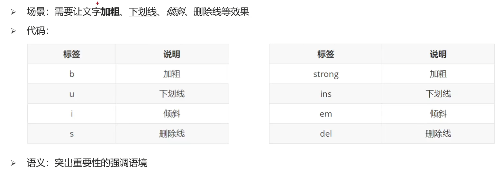


#### 媒体标签

###### 图片标签

**代码：**

**特点:** 单标签,只有图片加载失败才会显示alt里面的属性值。title属性当鼠标悬停时，才显示的文本。width和height属性值宽度和高度（**如果只设置了一个，另一个没有设置，图片会自动等比缩放，图片不会变形**）。

###### 路径

分类：相对路径和绝对路径

**相对路径：**从**当前文件**出发找目标文件的过程。
$$
相对路径
\begin{cases}
同级目录\\
下级目录\\
上级目录:../\\
\end{cases}
$$

###### 音频标签

**代码：**<audio src="" controls></audio><audio>

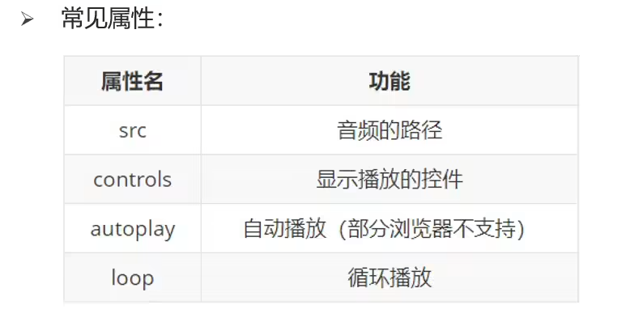

###### 视频标签

**代码：**<video src="" controls muted></video>

**注意：**muted属性是静音播放

##### 链接标签

**代码：** 

```html
<a href="./目标网址.html">超链接</a>
```

空链接就把**href**的值输入**#**


### 列表标签

#### 无序列表

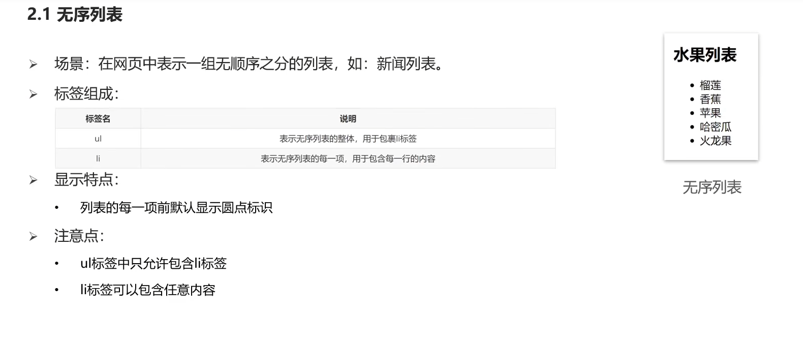

####  有序列表

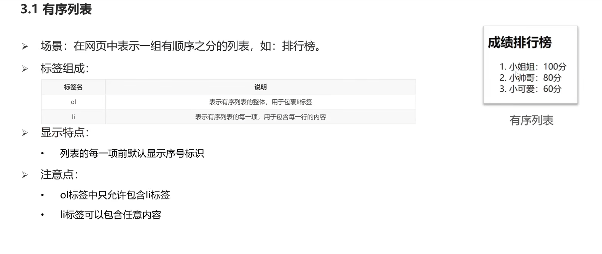 

#### 自定义列表


### 表格标签

#### 表格的基本标签

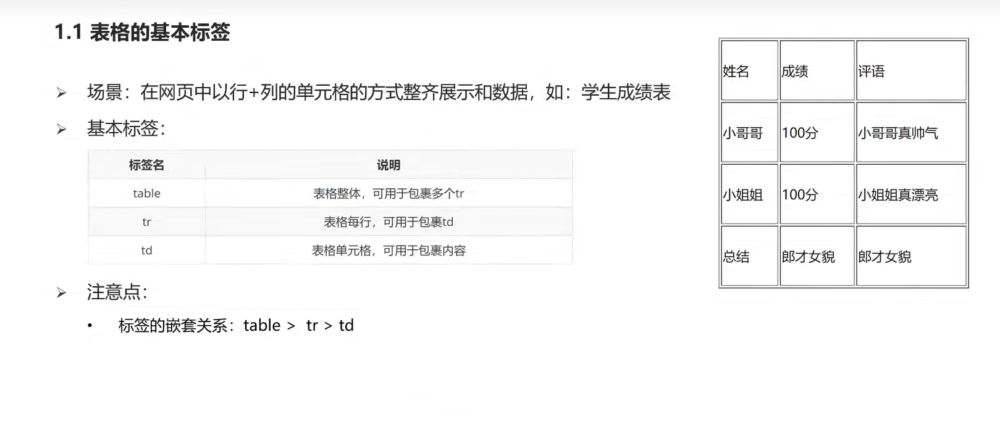

#### 表格的属性


#### 表格的标题和表头单元格标签

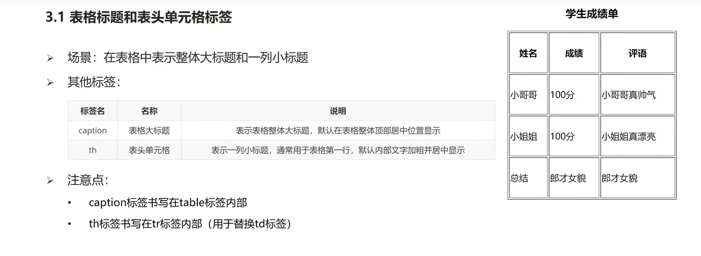

#### 合并单元格

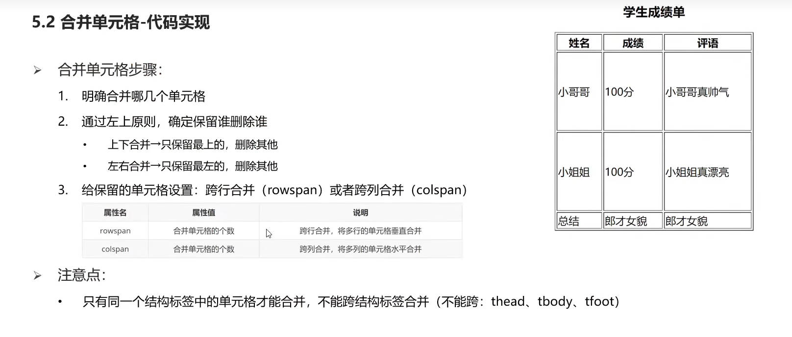

### 表单标签


#### input系列标签


##### 文本框

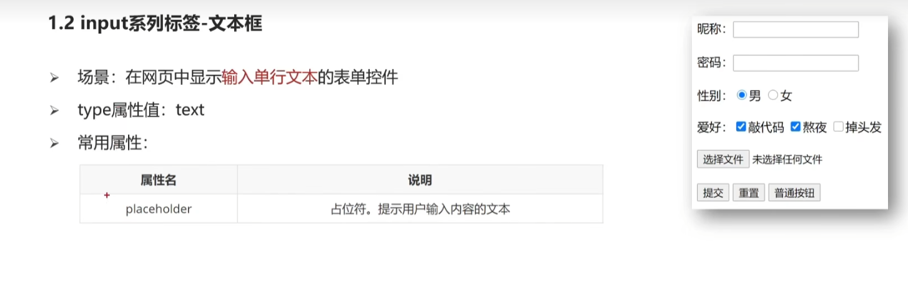

##### 单选框

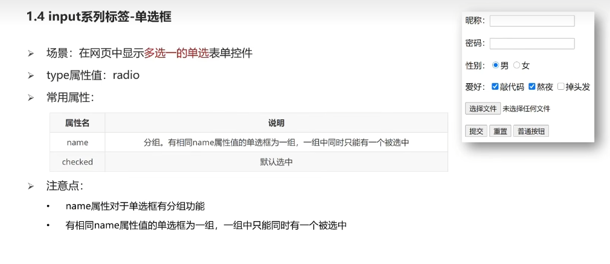

##### 文件选择

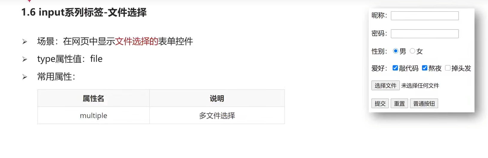

##### 按钮

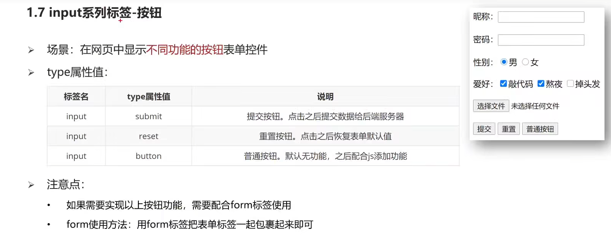

#### button按钮标签

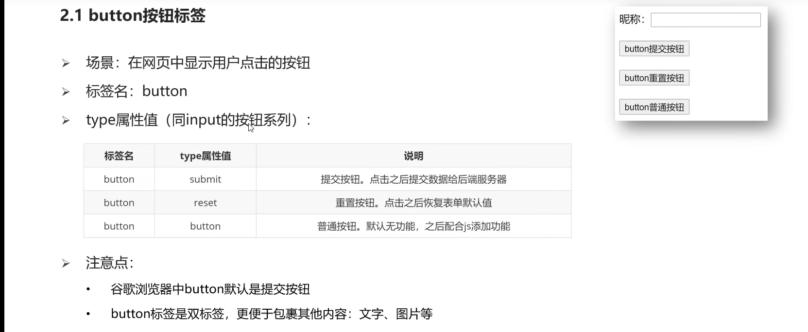

#### select下拉菜单标签

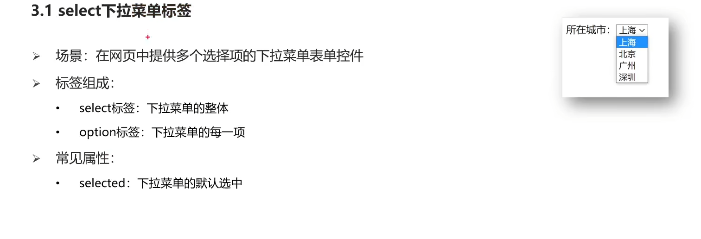

#### textarea文本域标签

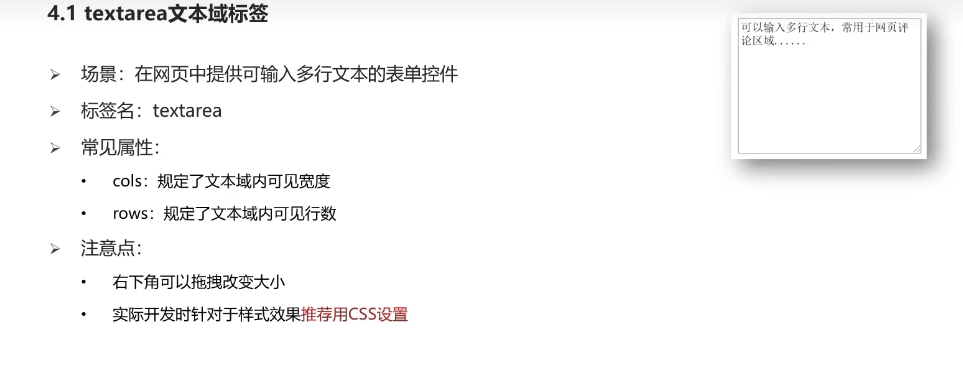

#### label标签

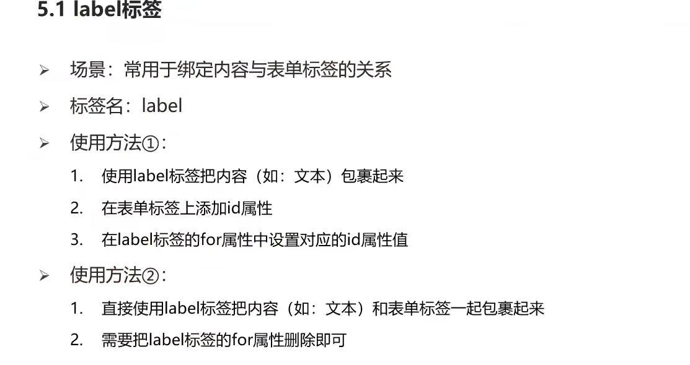

### 语义化标签

#### 没有语义的布局标签`div`和`span`

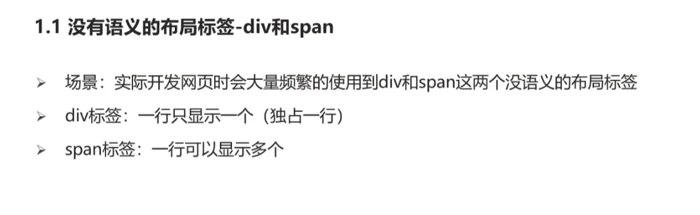

#### 有语义的布局标签（了解）


### 字符实体

#### 常见字符实体

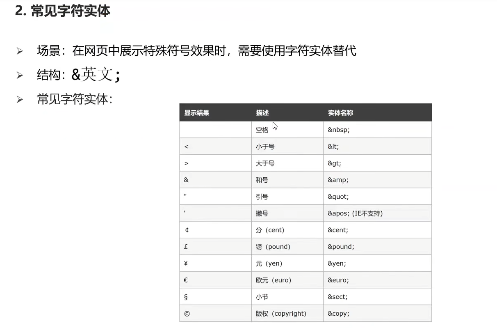
